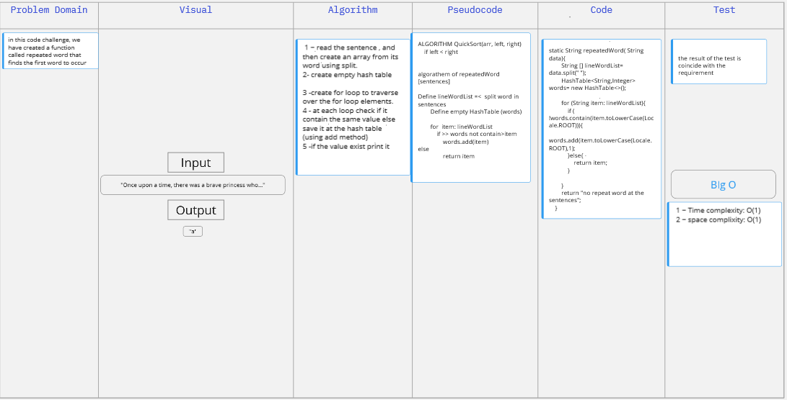
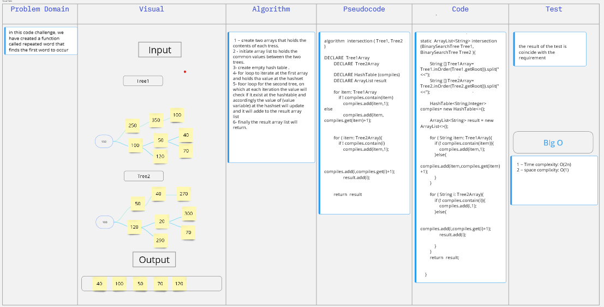

### Code Challenge: Class 30: Hash Table Implementation:
in this challenge a hash code data structure were created a hash table which  is a data structure that implements an associative array abstract data type, a structure that can map keys to values. 
the hashCode class use hashNode class to generate a node holds the buckets (key,value). Besides that the class contains several methods as follws: 
- add: takes two arguments(key, value), and then hash the key, and add the key and value pair to the table, handling collisions as needed.
- get: takes one argument(key), and returns the value associated with that key in the table
- contains: takes one argument(key), and returns true or false based on key exists in the table already.
- hash: takes one argument(key), and returns Index in the collection for that key.

###  Code Challenge: Class 31
 in this code challenge, we have created a function called repeated word that finds the first word to occur more than once in a string
 - 
 - [Link](https://miro.com/app/board/o9J_l9Wc_5c=/)
 

###  Code Challenge: Class 32
 in this code challenge, we have created a function called intersection  that finds the common values between two trees. 
 - 
 - [Link](https://miro.com/app/board/o9J_l9Wc_5c=/)

###  Code Challenge: Class 33
in this code challenge, we have created a function called leftJoin that LEFT JOINs two hashmaps into a single data structure. - 
 -  [Link](https://miro.com/app/board/o9J_l9Wc_5c=/)