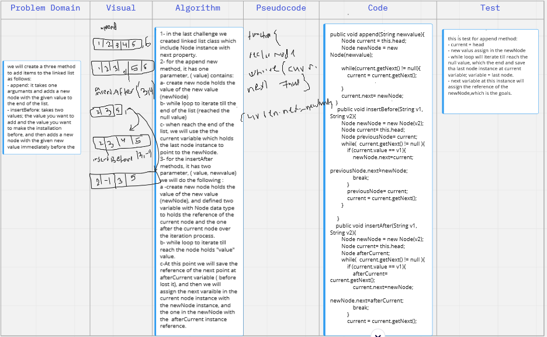
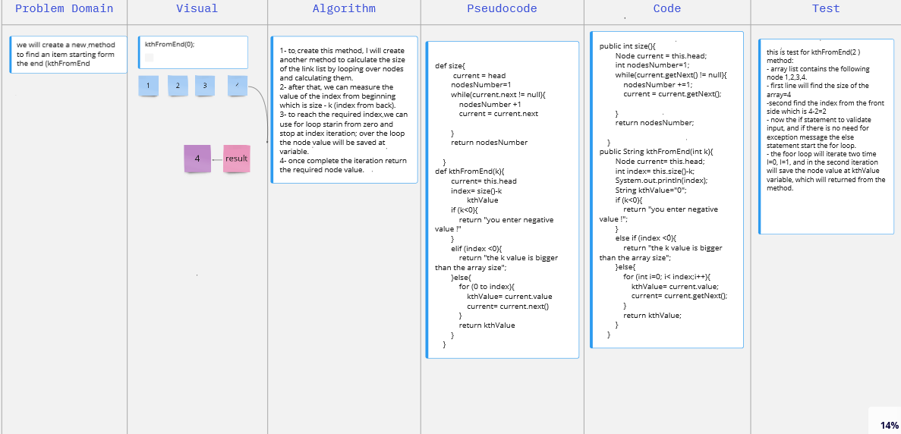
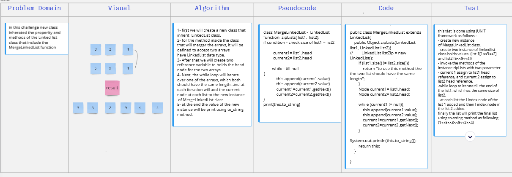
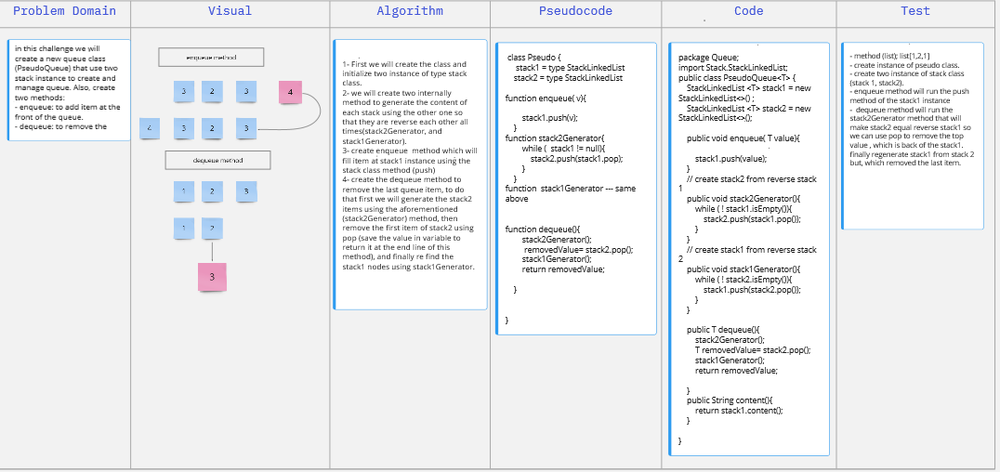
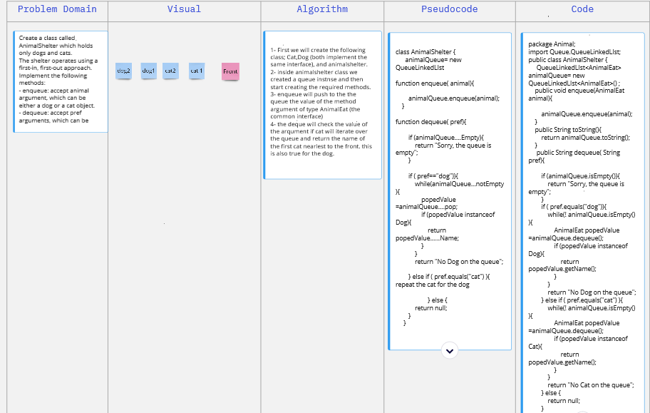
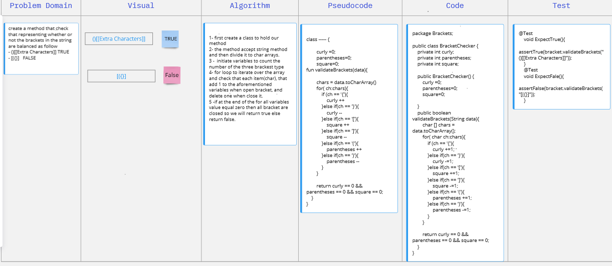

# Singly Linked List
A singly linked list is a type of linked list that is unidirectional, that is, it can be traversed in only one direction from head to the last node (tail). Each element in a linked list is called a node. A single node contains data and a pointer to the next node which helps in maintaining the structure of the list.
## Challenge
the aims of this challenge is to create a link list class plus make test for the class

## Approach & Efficiency & API
I created two classes, the first is the node which has two properity the value of the node plus the referance for the next node.
the second class is the linkedList class that hold one properity for the head node (data type is Node) as well as it contains a three methods as per the challege requorement as following: 
- insert: to add item to the list. the Big O used here is is O(1)
- includesL: to sheck if the list contains certain value. the Big O used here is is O(n)
- to string: to print out the linked list instances; the value of the nodes. the Big O used here is is O(n)

## Code Challenge 06: linked-list-insertions
in this challenge we had added the following methods: 
- append: it takes one argumants and adds a new node with the given value to the end of the list.
- insertBefore: takes two values; the value you want to add and the value you want to make the installation before, and then adds a new node with the given new value immediately before the first node that has the value specified.
- insertAfter: takes two arguments: value, new value; and then adds a new node with the given new value immediately after the first node that has the value specified.
-  for the whitebord exirsise: 
   - 
    - [Board link](https://miro.com/app/board/o9J_l9Wc_5c=/).
### Code Challenge: Class 07: 
in this challenge we created a new method to find a values of node at index k starting from the end of the array list. 
- for the whiteBoard exersise: 
   - 
      - [Board link](https://miro.com/app/board/o9J_l9Wc_5c=/).
   
### Code Challenge: Class 08
in this challenge new class inherated the properity and methods of the Linked list class that include the MergeLinkedList function that take two linkelist and merged them as represent in the following example:
- `zipLists(list1, list2)`
-  list1	Arg 	
`head -> [1] -> [3] -> [2] -> X`		
- list2
  `head -> [5] -> [9] -> [4] -> X`
- Output
  `head -> [1] -> [5] -> [3] -> [9] -> [2] -> [4] -> X`

- for the whiteBoard exersise:
    - 
        - [Board link](https://miro.com/app/board/o9J_l9Wc_5c=/).
    
### Code Challenge: Class 10: Stack and a Queue Implementation:
in this lab we created a two class; QueueLinkedlist and StacklinkedList to simulate the queue and slack data structure respectively. 
- QueueLinkedlist includes the following methods: 
    - enqueue: add new  node to the back of the queue. 
    - dequeue: it returns the value from node from the front of the queue, and removes the node from the front of the queue.
    - peek: it returns value of the node located at the front of the queue, and raise exception when called on empty stack.
    - isEmpty: returns: Boolean indicating whether or not the queue is empty. 
-StacklinkedList: 
    - push: add new  node to the top of the stack.
    - pop: returns the value from node from the top of the stack, removes the node from the top of the stack, and raise exception when called on empty stack.
    - peek: returns value of the node located at the top of the stack, and raise exception when called on empty stack.
    - isEmpty: returns: Boolean indicating whether or not the stack is empty. 
### Code Challenge: Class 11
to solve this challenge I had created a new class PseudoQueue include: 
- two instance of StacklinkedList class that will use to create and manage the queue. 
- enqueue method: that a value and added it to the begining of the queue. 
- dequeue method will pop the value at the end of the queue. 

- for the whiteBoard exersise:
    - 
        - [Board link](https://miro.com/app/board/o9J_l9Wc_5c=/).
### Code Challenge: Class 12
Create a class called AnimalShelter which holds only dogs and cats.
The shelter operates using a first-in, first-out approach.
Implement the following methods:
- enqueue: accept animal argument, which can be either a dog or a cat object.
  -dequeue: accept pref arguments, which can be either "dog" or "cat". it return: either a dog or a cat, based on preference, or If pref is not "dog" or "cat" then return null.

- for the whiteBoard exersise:
    - 
        - [Board link](https://miro.com/app/board/o9J_l9Wc_5c=/).
### Code Challenge: Class 13 Multi-bracket Validation.

in this challenge we created a method that validate brackets
- for the whiteBoard exersise:
    - 
        - [Board link](https://miro.com/app/board/o9J_l9Wc_5c=/).
